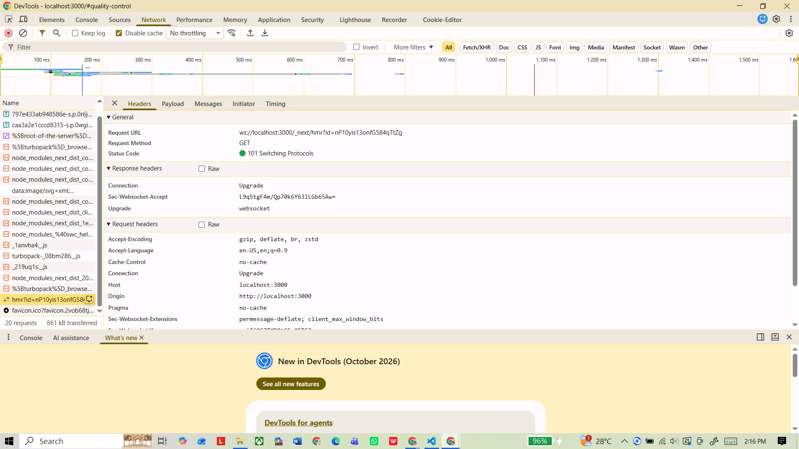
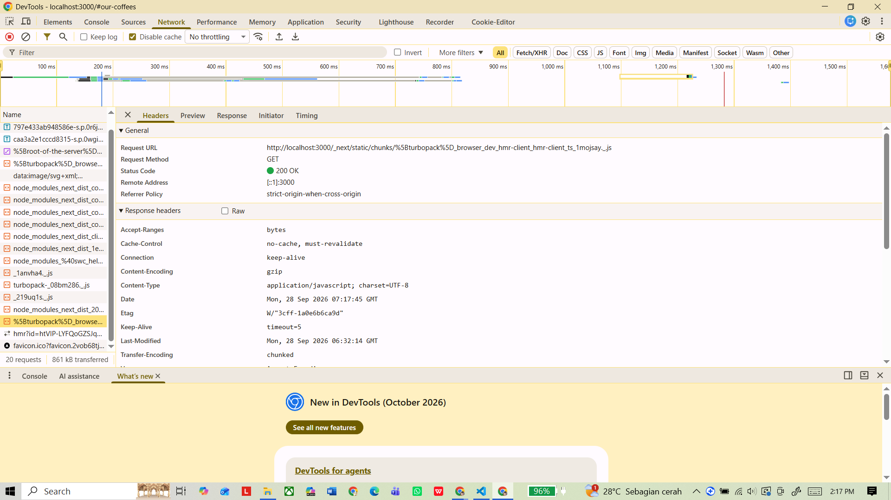

# Dokumen Teknis Modul 1 — Lingkungan Pengembangan, Git, dan Lalu Lintas HTTP

**Nama:** Bagas  
**NIM:** 105224049  
**Repositori:** https://github.com/urbbaone/Praktikum-PAW-105224049-Bagas

## 1. Lingkungan Pengembangan

| Komponen | Keterangan |
|---|---|
| Sistem Operasi | Windows; terlihat dari path proyek `C:\Users\lenovo\...` dan tampilan DevTools Windows |
| Node.js | Node.js 24 LTS merupakan versi acuan pada Modul 1; versi runtime yang benar-benar terpasang tidak tercatat dalam arsip |
| npm | npm 11.x merupakan versi acuan pada Modul 1; versi aktual tidak tercatat dalam arsip |
| Git | Digunakan untuk repository; versi aktual tidak tercatat dalam arsip |
| Visual Studio Code | Digunakan untuk mengembangkan proyek; versi aktual tidak tercatat dalam arsip |
| Next.js | 16.3.6, berdasarkan `my-app/package.json` |
| React | 19.2.8, berdasarkan `my-app/package.json` |

### Struktur proyek

Repository berisi aplikasi Next.js di folder `my-app/`. Berkas utama yang terdeteksi antara lain:

```text
PAW Modul 1/
├── .git/
├── docs/
│   └── praktikum/
│       ├── 101.png
│       └── 200.png
└── my-app/
    ├── app/
    │   ├── favicon.ico
    │   ├── globals.css
    │   ├── layout.tsx
    │   └── page.tsx
    ├── public/
    ├── .gitignore
    ├── AGENTS.md
    ├── README.md
    ├── package.json
    ├── package-lock.json
    ├── next.config.ts
    ├── postcss.config.mjs
    ├── eslint.config.mjs
    └── tsconfig.json
```

### Produk yang dibuat

Aplikasi pada `my-app/app/page.tsx` merupakan landing page bertema **Nusantara Coffee Export**. Halaman memuat bagian Home, Quality Control, Our Coffees, grading classification, contact, dan footer.

Komponen yang tampak pada halaman antara lain:

- **Quality Control Process:** Cherry Selection, Wet Processing, Drying & Moisture Control, Defect Sorting, Cupping & Sensory Analysis, dan Export Packaging.
- **Coffee Varieties:** Gayo Arabica, Toraja Kalosi, Java Preanger, dan Bali Kintamani.
- **Export Grading Classification:** Grade 1 sampai Grade 4 beserta defect limit, SCA score, dan market.

## 2. Alur Kerja Git

### 2.1 Remote Repository

Remote `origin` yang tercatat pada konfigurasi Git:

```text
https://github.com/urbbaone/Praktikum-PAW-105224049-Bagas.git
```

Branch aktif dan branch remote yang tercatat pada arsip adalah `main`.

### 2.2 Riwayat Commit

Perintah yang digunakan untuk melihat riwayat:

```bash
git log --oneline --graph --decorate --all
```

Berdasarkan repository yang tersimpan di arsip, hasil riwayat saat dokumentasi adalah:

```text
* 2630847 (HEAD -> main, origin/main) DOKTEK 1
```

Commit yang ada:

| Hash | Pesan | Keterangan |
|---|---|---|
| `2630847` | `DOKTEK 1` | Commit yang menjadi `HEAD` dan sudah tersinkron dengan `origin/main` |

### 2.3 Pull Request

Pada pemeriksaan repository GitHub saat penyusunan dokumen, repository menunjukkan **0 Pull Request terbuka dan 0 Pull Request tertutup**. Dengan demikian, belum terdapat Pull Request yang dapat dicantumkan sebagai PR yang telah di-merge.

Tautan repository:

https://github.com/urbbaone/Praktikum-PAW-105224049-Bagas

Status Pull Request saat pemeriksaan: **belum ada PR**.

### 2.4 Branch, Merge, dan Konflik

Arsip `.git` hanya menunjukkan branch `main` dan remote `origin/main`. Tidak terdapat riwayat branch latihan, merge commit, atau catatan konflik `README.md` pada riwayat yang tersimpan.

Dengan demikian, pada versi proyek yang diarsipkan:

- branch latihan konflik belum terdokumentasi;
- merge konflik belum terdokumentasi;
- merge commit belum terdokumentasi;
- proses penyelesaian konflik belum dapat direkonstruksi dari artefak yang tersedia.

Hal ini perlu diselesaikan pada repository asli sebelum pengumpulan apabila dosen/asisten mewajibkan checkpoint branch, merge, dan konflik.

## 3. Pengamatan Lalu Lintas HTTP

### 3.1 Bukti DevTools: Status 101 Switching Protocols

Bukti tersimpan pada `docs/praktikum/101.png`.

Pada screenshot, request yang dipilih adalah koneksi Hot Module Replacement (HMR) Next.js melalui WebSocket:

| Komponen | Hasil pengamatan |
|---|---|
| Request URL | `ws://localhost:3000/_next/hmr?id=nP10yis13onfG584qTzG` |
| Request Method | `GET` |
| Status Code | `101 Switching Protocols` |
| Connection | `Upgrade` |
| Upgrade | `websocket` |
| Host | `localhost:3000` |
| Origin | `http://localhost:3000` |
| Cache-Control | `no-cache` |

Kode status `101 Switching Protocols` digunakan ketika server menyetujui perpindahan protokol; untuk WebSocket, browser mengirim header `Upgrade: websocket` dan `Connection: Upgrade`, kemudian server mengembalikan status 101. https://developer.mozilla.org/en-US/docs/Web/HTTP/Reference/Status/101

### 3.2 Bukti DevTools: Status 200 OK

Bukti tersimpan pada `docs/praktikum/200.png`.

Request yang dipilih merupakan berkas JavaScript milik Next.js/Turbopack:

| Komponen | Hasil pengamatan |
|---|---|
| Request URL | `http://localhost:3000/_next/static/chunks/%5Bturbopack%5D_browser_dev_hmr-client_hmr-client_ts_1mojsqy_.js` |
| Request Method | `GET` |
| Status Code | `200 OK` |
| Remote Address | `[::1]:3000` |
| Content-Type | `application/javascript; charset=UTF-8` |
| Cache-Control | `no-cache, must-revalidate` |
| Connection | `keep-alive` |
| Content-Encoding | `gzip` |
| ETag | `W/"3cff-1a0e6b6ca9d"` |
| Last-Modified | `Mon, 28 Sep 2026 06:32:14 GMT` |
| Transfer-Encoding | `chunked` |

Status `200 OK` menunjukkan request berhasil diproses. Untuk GET, resource dikirim sebagai response body. https://developer.mozilla.org/en-US/docs/Web/HTTP/Reference/Status/200

### 3.3 Tabel Pengamatan HTTP Modul 1

| No. | URL / Resource | Method | Status | Content-Type | Header / Catatan |
|---|---|---|---|---|---|
| 1 | `ws://localhost:3000/_next/hmr?id=nP10yis13onfG584qTzG` | GET | **101** | Tidak ditampilkan sebagai Content-Type pada screenshot | `Connection: Upgrade`, `Upgrade: websocket`; koneksi HMR WebSocket |
| 2 | `http://localhost:3000/_next/static/chunks/%5Bturbopack%5D_browser_dev_hmr-client_hmr-client_ts_1mojsqy_.js` | GET | **200** | `application/javascript; charset=UTF-8` | `Cache-Control: no-cache, must-revalidate`, `Content-Encoding: gzip`, `ETag`, `Last-Modified` |
| 3 | `http://localhost:3000/` | GET | **200** | HTML | Halaman utama berhasil dimuat pada localhost; detail header document tidak tersimpan dalam screenshot arsip |
| 4 | `http://localhost:3000/halaman-tidak-ada` | GET | **404** | HTML | Endpoint ini memang diminta modul untuk pengujian rute tidak ditemukan; screenshot hasil request 404 tidak tersimpan dalam arsip |
| 5 | `http://github.com` melalui `curl -I` | HEAD | **301** | Bervariasi | Modul menyebut request ini menghasilkan `301` dengan header `Location` menuju alamat HTTPS |
| 6 | `https://developer.mozilla.org` dengan cache | GET | **200 / 304** | Bervariasi | Status bergantung pada kondisi cache; `304` digunakan saat resource tervalidasi dan tidak berubah |

### 3.4 Screenshot DevTools

#### Status 101



#### Status 200



### 3.5 Keluaran curl yang Digunakan

Perintah praktikum:

```bash
curl -I http://localhost:3000
curl -I http://github.com
curl -v https://example.com
```

Pada Windows PowerShell, bentuk yang disarankan modul adalah `curl.exe` agar yang digunakan adalah program curl, bukan alias `Invoke-WebRequest`.

Contoh penggunaan yang ekuivalen di PowerShell:

```powershell
curl.exe -I http://localhost:3000
curl.exe -I http://github.com
curl.exe -v https://example.com
```

Output terminal lengkap dari tiga perintah tersebut tidak tersimpan di arsip `.rar`, sehingga tidak dituliskan sebagai output aktual.

`curl -I` melakukan request **HEAD**, sehingga yang dicatat sebagai method adalah HEAD, bukan GET. Metode HEAD meminta metadata/header tanpa response body. https://developer.mozilla.org/en-US/docs/Web/HTTP/Reference/Methods/HEAD

### 3.6 Analisis Cache

Pada screenshot status 200 untuk berkas JavaScript lokal terlihat header `Cache-Control: no-cache, must-revalidate`. Karena halaman dikembangkan dalam mode development, browser melakukan request terhadap aset development dan menampilkan resource melalui jaringan lokal.

Untuk pemuatan dengan cache, browser dapat menggunakan resource yang telah disimpan. Saat melakukan validasi ulang, server dapat mengembalikan `304 Not Modified`, yang berarti resource tidak perlu dikirim ulang dan browser boleh menggunakan salinan cache yang sudah dimiliki. Response 304 tidak membawa body dan biasanya berkaitan dengan validator seperti `ETag` atau `Last-Modified`.

Perbedaan sederhananya:

| Kondisi | Status yang umum | Dampak |
|---|---|---|
| Resource diminta dan berhasil dikirim | `200 OK` | Resource dikirim dari server |
| Resource di-cache dan masih valid setelah validasi | `304 Not Modified` | Browser memakai salinan cache sehingga isi resource tidak dikirim ulang |
| Pengalihan URL | `301 Moved Permanently` | Client diarahkan ke URL baru melalui `Location` |

### 3.7 Mengapa `http://github.com` Dialihkan

Modul praktikum menyebut bahwa `curl -I http://github.com` menghasilkan status `301` dengan header `Location` yang mengarah ke alamat HTTPS. Status 301 menandakan resource telah dipindahkan secara permanen ke URL lain.

Redirect tersebut membuat client berpindah dari HTTP ke HTTPS sehingga koneksi berikutnya menggunakan HTTPS.

### 3.8 Contoh Status HTTP Tambahan dari Web

Status code HTTP dikelompokkan menjadi lima kelas: 1xx informasi, 2xx berhasil, 3xx pengalihan, 4xx kesalahan client, dan 5xx kesalahan server.

| Kelas | Contoh | Makna |
|---|---|---|
| 1xx | **101 Switching Protocols** | Server menyetujui perpindahan protokol, misalnya HTTP ke WebSocket |
| 2xx | **200 OK** | Request berhasil |
| 3xx | **300 Multiple Choices** / **301 Moved Permanently** | Redirect atau pilihan representasi/resource lain |
| 4xx | **400 Bad Request** / **404 Not Found** | Masalah berada pada request client atau resource tidak ditemukan |
| 5xx | **500 Internal Server Error** | Server mengalami kondisi tak terduga sehingga request tidak dapat dipenuhi |

Status 300 merupakan response redirect yang memungkinkan beberapa pilihan; status 301 menyatakan URL resource berubah secara permanen.

Status 404 menunjukkan bahwa server tidak menemukan resource yang diminta.

Status 500 merupakan error umum di sisi server ketika terjadi kondisi tak terduga yang menghalangi pemenuhan request.
> Catatan: tabel contoh 300/400/500 di atas merupakan referensi web untuk memahami kelas status, bukan klaim bahwa status tersebut semuanya tertangkap pada screenshot praktikum ini.

## 4. Kendala dan Penyelesaian

### 4.1 Hydration mismatch pada Next.js

Log development yang tersimpan di `.next/dev/logs/next-development.log` mencatat error browser tentang ketidaksesuaian atribut hasil server dan client pada elemen `<html>`, khususnya perbedaan class font `geist` yang dihasilkan.

Contoh inti pesan pada log:

```text
A tree hydrated but some attributes of the server rendered HTML didn't match the client properties.
```

Log tersebut juga menunjukkan perbedaan class font pada elemen `<html>`.

Pada arsip tidak terdapat commit khusus yang menunjukkan penyelesaian error ini. Karena itu, dokumentasi yang aman adalah: **kendala terdeteksi pada sesi development, tetapi langkah perbaikannya tidak tercatat di repository yang diarsipkan**.

### 4.2 Perubahan `package.json`

Working tree pada arsip menunjukkan `my-app/package.json` berbeda hanya pada line ending di baris penutup file (`LF`/`CRLF`). Tidak ada perubahan dependensi yang terlihat pada diff.

## 5. Catatan Pemanfaatan AI

**Alat:** ChatGPT, CLAUDE.

**Bagian yang digunakan:** penyusunan Dokumen Teknis Modul 1 dalam format Markdown, perapian struktur heading/tabel, dan bantuan membaca artefak repository serta screenshot HTTP.

**Perintah utama yang didokumentasikan:**

```bash
git log --oneline --graph --decorate --all
git remote -v
git branch -avv
```

**Cara verifikasi:** isi dokumen dicocokkan dengan:

1. file Git dan riwayat commit pada arsip `PAW Modul 1.rar`;
2. `my-app/package.json` untuk versi dependency Next.js/React;
3. `docs/praktikum/101.png` untuk request status 101;
4. `docs/praktikum/200.png` untuk request status 200;
5. halaman repository GitHub untuk status branch, jumlah commit, dan Pull Request;
6. dokumentasi MDN untuk definisi status HTTP dan metode HEAD.

## 6. Kesimpulan

Praktikum Modul 1 menghasilkan repository Next.js bertema **Nusantara Coffee Export** dengan aplikasi yang berjalan pada `localhost:3000`. Repository menggunakan branch `main` dan remote GitHub yang sesuai.

Pada artefak yang tersedia, bukti HTTP yang paling jelas adalah:

- **101 Switching Protocols** untuk koneksi HMR WebSocket;
- **200 OK** untuk resource JavaScript Next.js/Turbopack.

Repository juga sudah terhubung ke `origin/main`, tetapi pada saat pemeriksaan GitHub masih terdapat **1 commit dan belum ada Pull Request**. Oleh sebab itu, bagian checkpoint branch/merge/conflict dan Pull Request belum terdokumentasi pada arsip ini dan masih perlu dikerjakan pada repository asli agar seluruh ketentuan Modul 1 terpenuhi.

